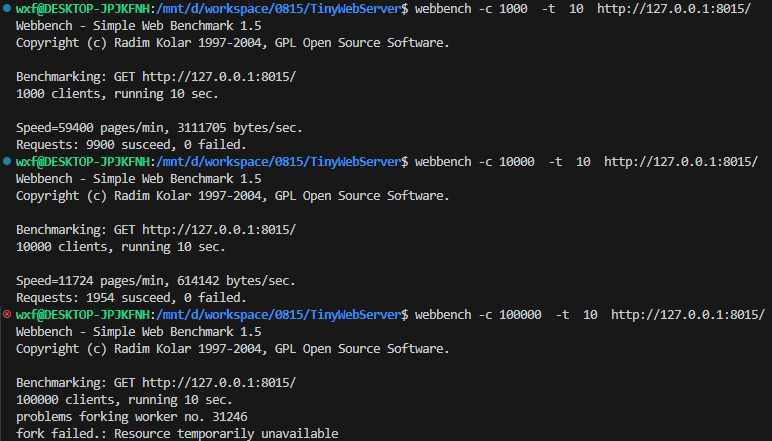

# TinyWebServer
A C++ based lightweight Web server, using socket and HTTP protocol to achieve the communication between the client and the server

# Run

```
make clean && make

./webserver

```

在浏览器输入    http://127.0.0.1:8015/

# 测试

https://blog.csdn.net/zou_albert/article/details/115368710




Tools:

* Mysql

    https://blog.csdn.net/qq_44722915/article/details/106020210

    https://blog.csdn.net/csdndogo/article/details/130117970